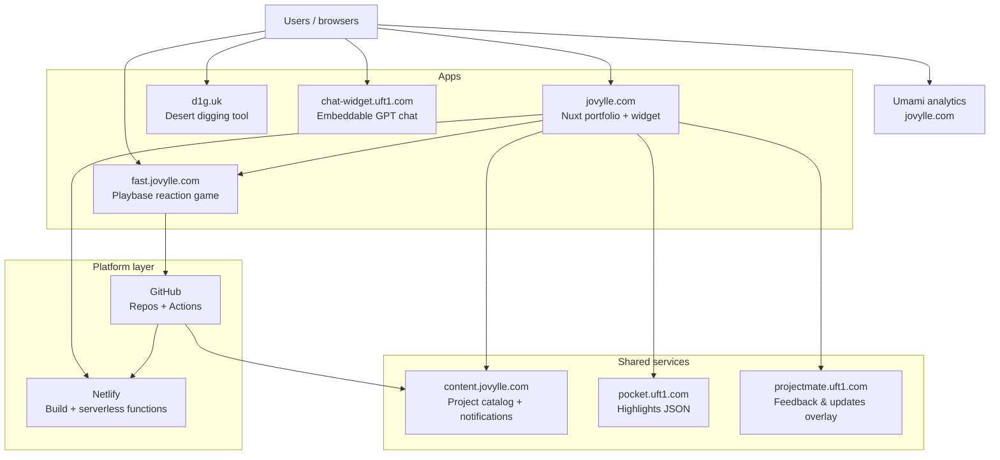

These projects share ingress patterns, embeddable services, and repeatable ops habits—not five unrelated demos. The portfolio is the hub; production apps feed data back into it and into GitHub.

---

## Architecture overview

*Alt text: Architecture diagram showing browsers connecting to portfolio, Playbase, d1g.uk, and chat-widget; content.jovylle.com for catalog + notifications, pocket.uft1.com for highlights, projectmate.uft1.com for feedback; Netlify and GitHub as platform; Umami for site analytics.*

---

## Products in the ecosystem

### Portfolio — [jovylle.com](https://jovylle.com)

**Problem:** Recruiters need one place to see shipped work, not a scatter of repos.

**Role in the platform:** Central hub. Nuxt 3 site on Netlify with a floating widget (AI chat, Playbase leaderboard, notifications), ProjectMate embed for feedback/updates, and a prerendered project archive fed by `content.jovylle.com`.

**Case study:** [Personal projects archive](/personal-projects) · [GitHub](https://github.com/jovylle/jovylle.com)

---

### d1g.uk — [d1g.uk](https://d1g.uk)

**Problem:** Sunflower Land players need a fast, visual way to plan Desert digs when the in-game API only shows today.

**Role in the platform:** Highest-traffic standalone product in the ecosystem. Companion hub at [hub.d1g.uk](https://hub.d1g.uk) for saved/shared community grids. Shares the uft1/d1g domain family with other tools.

**Case study:** [GitHub — sfl-crab](https://github.com/jovylle/sfl-crab) · [User feedback](https://d1g.uk/feedbacks)

---

### Playbase — [fast.jovylle.com](https://fast.jovylle.com)

**Problem:** A lightweight, replayable skill game that keeps score across sessions and surfaces results outside the game tab.

**Role in the platform:** Gamification layer. Reaction-test game with an all-time leaderboard JSON API (`/reaction/top.json`). The portfolio widget proxies this via `/api/leaderboard` and links directly to play. Seasonal leaderboard is synced through GitHub Actions.

**Case study:** [GitHub — playbase](https://github.com/jovylle/playbase)

---

### chat-widget — [chat-widget.uft1.com](https://chat-widget.uft1.com)

**Problem:** Drop a GPT-powered chatbot onto any site without rebuilding the host app.

**Role in the platform:** Reusable embed product (separate from the portfolio's own AI widget). Standalone script + Netlify/serverless backend pattern, same "one script tag" philosophy as ProjectMate.

**Case study:** [GitHub — chatbot-widget](https://github.com/jovylle/chatbot-widget)

---

### ProjectMate — [projectmate.uft1.com](https://projectmate.uft1.com)

**Problem:** Visitors need in-context feedback and release notes without leaving the page or opening GitHub Issues.

**Role in the platform:** Cross-site support overlay. Loaded on jovylle.com via `embed.js` with `projectId: jovylle-com` — feedback, updates, and about panel; chat disabled on portfolio. Same embed pattern can attach to other properties in the uft1.com family.

**Case study:** [GitHub — projectmate-embedded-app](https://github.com/jovylle/projectmate-embedded-app)

---

## Infrastructure highlights

- **Netlify for jovylle.com** — static Nuxt build, `/.netlify/functions/chatbot` for production AI chat, `/api/leaderboard` proxy in dev and prod.
- **Decoupled content CDN** — project catalog at `content.jovylle.com`; portfolio rebuild triggered by GitHub Actions → Netlify build hook after CDN publish (hook URL in GitHub secrets, not in git).
- **Notification bus** — `content.jovylle.com/notifications/index.json` feeds the portfolio widget's alert tab.
- **Highlights feed** — `pocket.uft1.com/data/highlights.json` powers `/highlights` and the widget highlights view.
- **Embeds over iframes where it matters** — ProjectMate overlay, portfolio widget (`embed-inline.js`), and chat-widget each ship as a single async script.
- **Secrets out of repo** — `OPENAI_API_KEY` via Netlify env; build hooks via GitHub Actions secrets.
- **Prerender vs live fetch** — `/personal-projects` prerendered from CDN JSON at build time; `/highlights` fetches live at runtime (different freshness tradeoffs, intentional).
- **GitHub as integration bus** — profile automation repo (`jovylle/jovylle`, GitHub Actions), content rebuild webhooks, and Playbase leaderboard automation.

> Edge/CDN provider for `uft1.com` and `d1g.uk`, and chat-widget consumer sites, are intentionally not listed publicly until confirmed.

---

## Cross-project flows

### 1. Play → score → portfolio (and GitHub)

1. User plays the reaction test at [fast.jovylle.com](https://fast.jovylle.com).
2. Score is persisted server-side; top entries exposed at `https://fast.jovylle.com/reaction/top.json`.
3. Portfolio widget on [jovylle.com](https://jovylle.com) fetches via `/api/leaderboard` and shows live top players with a "Play now" link.
4. GitHub profile README updated by Actions in the Playbase / profile automation repos (exact pipeline: see [playbase](https://github.com/jovylle/playbase) and [jovylle/jovylle](https://github.com/jovylle/jovylle)).

### 2. Visitor uses d1g.uk

1. Player opens [d1g.uk](https://d1g.uk) for today's Desert grid visualization.
2. Tool runs as a Nuxt/serverless front-end (repo: `sfl-crab`); optional feedback via [d1g.uk/feedbacks](https://d1g.uk/feedbacks).
3. Community history and shared grids live on [hub.d1g.uk](https://hub.d1g.uk) (separate repo: `sfl-digging-hub`).

### 3. Support & notifications on portfolio

1. Visitor lands on jovylle.com; widget loads notifications from `content.jovylle.com/notifications/index.json`.
2. Support action opens the ProjectMate overlay (`projectmate.uft1.com`) for feedback and release notes.
3. AI chat tab calls Netlify serverless function with portfolio context (when enabled); widget itself carries no third-party analytics.

---

## Impact & metrics

| Metric | Source | Note |
|--------|--------|------|
| d1g.uk daily visitors | Project catalog metadata | ~300/day (self-reported in CMS catalog; verify with analytics export) |
| Portfolio traffic | Umami (`jovylle.com`) | Regular daily usage; no public DAU/WAU figure |
| Playbase leaderboard | `fast.jovylle.com/reaction/top.json` | Public JSON; all-time archive on game site |
| Content freshness | GitHub Actions → Netlify hook | Rebuild after `content.jovylle.com` JSON updates |
| Widget notification reach | `content.jovylle.com/notifications/index.json` | Tag-filtered (`jovylle.com,all`) on portfolio |
| chat-widget adoption | TBD | Confirm embed domains before publishing counts |

---

## What I'd improve next

1. **Single observability layer** — Umami covers the portfolio; d1g.uk, Playbase, and uft1 subdomains lack a unified dashboard. I'd add consistent uptime checks and error logging across the ecosystem, not just the main site.
2. **Hostname clarity** — Playbase (`fast.jovylle.com` vs `playbase.jovylle.com`) and the three embed products (portfolio widget, chat-widget, ProjectMate) need a public map so integrators know which script to use.
3. **Document cross-repo data contracts** — leaderboard JSON, notification index, and CDN project schema are integration APIs today but undocumented for external consumers; I'd version and publish them.

---

## Explore the ecosystem

**Live**

- [jovylle.com](https://jovylle.com) — Portfolio & widget hub
- [d1g.uk](https://d1g.uk) — Desert digging tool
- [hub.d1g.uk](https://hub.d1g.uk) — Community digging hub
- [fast.jovylle.com](https://fast.jovylle.com) — Playbase reaction game
- [chat-widget.uft1.com](https://chat-widget.uft1.com) — Embeddable chatbot
- [projectmate.uft1.com](https://projectmate.uft1.com) — Feedback & updates overlay
- [uft1.com](https://uft1.com) — Utility tools hub

**GitHub**

- [jovylle.com](https://github.com/jovylle/jovylle.com) · [sfl-crab](https://github.com/jovylle/sfl-crab) · [playbase](https://github.com/jovylle/playbase) · [chatbot-widget](https://github.com/jovylle/chatbot-widget) · [projectmate-embedded-app](https://github.com/jovylle/projectmate-embedded-app) · [Profile automation](https://github.com/jovylle/jovylle)

---

*Built by Jovylle Bermudez — infrastructure-minded full-stack engineer. Questions: [me@jovylle.com](mailto:me@jovylle.com).*
