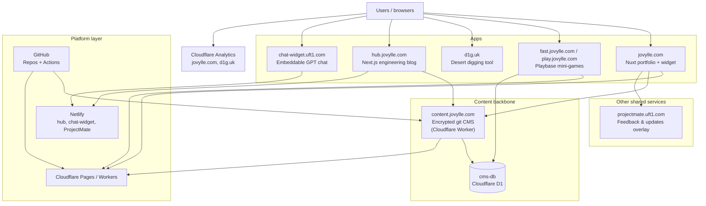

These projects share a content backbone, embeddable services, and repeatable ops habits — not a pile of unrelated demos. The portfolio is the front door; a shared encrypted CMS and database are the backbone underneath it.

---

## Architecture overview

*Alt text: Architecture diagram showing browsers connecting to the portfolio, Playbase, d1g.uk, the Hub blog, and chat-widget; content.jovylle.com (an encrypted git CMS on a Cloudflare Worker) and its shared cms-db D1 database as the content backbone; projectmate.uft1.com as a feedback overlay; Cloudflare Pages/Workers and Netlify as platform, with GitHub as the source of truth and CI.*

---

## Products in the ecosystem

### Portfolio — [jovylle.com](https://jovylle.com)

**Problem:** Recruiters need one place to see shipped work, not a scatter of repos.

**Role in the platform:** Front door. Nuxt 3 site statically generated and deployed to Cloudflare Pages, with a floating widget (AI chat, Playbase leaderboard, notifications), a ProjectMate embed for feedback/updates, and a prerendered project archive fed by `content.jovylle.com`.

**Case study:** [Personal projects archive](/personal-projects) · [GitHub](https://github.com/jovylle/jovylle.com)

---

### Content CMS — [content.jovylle.com](https://content.jovylle.com)

**Problem:** Several independent sites need one source of truth for posts, project metadata, and app data — without a plaintext CMS repo or a heavyweight headless CMS subscription.

**Role in the platform:** The ecosystem's backbone. Content is authored locally, AES-256-GCM encrypted client-side, and only the ciphertext is committed to git — the decrypt key never leaves the server. A Cloudflare Worker either live-decrypts collections on request or exports filtered public JSON at build time. It also fronts a shared Cloudflare D1 database (`cms-db`) with a public HTTP API (feature flags, contacts, comments, likes, conversations) that any consumer can call directly — CORS is wide open by design.

**Consumers:** [jovylle.com](https://jovylle.com) (prerender), [Hub](https://hub.jovylle.com) (live fetch), [Playbase](https://fast.jovylle.com) (shares the same D1 database directly). Successor to the retired `pocket.uft1.com` / `my-json-database`.

**Case study:** [GitHub — static-encrypted-git-cms](https://github.com/jovylle/static-encrypted-git-cms)

---

### d1g.uk — [d1g.uk](https://d1g.uk)

**Problem:** Sunflower Land players need a fast, visual way to plan Desert digs when the in-game API only shows today.

**Role in the platform:** Highest-traffic standalone product in the ecosystem — the only tool with steady, verified daily traffic (see [live usage](/impact)). Companion hub at [hub.d1g.uk](https://hub.d1g.uk) for saved/shared community grids. Shares the uft1/d1g domain family with other tools.

**Case study:** [GitHub — sfl-crab](https://github.com/jovylle/sfl-crab) · [User feedback](https://d1g.uk/feedbacks)

---

### Playbase — [fast.jovylle.com](https://fast.jovylle.com) / [play.jovylle.com](https://play.jovylle.com)

**Problem:** Lightweight, replayable skill games that keep score across sessions and surface results outside the game tab.

**Role in the platform:** Gamification layer. Four browser games (Reaction Tester, Number Memory, Chimp Test, Aim Trainer) running on a Cloudflare Worker. Scores read/write directly against the shared `cms-db` D1 database — no JSON file or HTTP proxy hop, since it runs on the same platform as the CMS. Public API at `/api/scores` and `/api/games`.

**Case study:** [GitHub — playbase](https://github.com/jovylle/playbase)

---

### Hub — [hub.jovylle.com](https://hub.jovylle.com)

**Problem:** Longer-form engineering notes and project write-ups need a home separate from the portfolio's project-archive format.

**Role in the platform:** Next.js/MDX engineering blog ("jovhub"). Fetches posts and images live from `content.jovylle.com`'s CMS API rather than storing content locally — a proving ground for the CMS's public-consumer contract.

**Case study:** [GitHub — hub](https://github.com/jovylle/hub)

---

### chat-widget — [chat-widget.uft1.com](https://chat-widget.uft1.com)

**Problem:** Drop a GPT-powered chatbot onto any site without rebuilding the host app.

**Role in the platform:** Reusable embed product (separate from the portfolio's own AI widget). Standalone script + serverless backend pattern, same "one script tag" philosophy as ProjectMate.

**Case study:** [GitHub — chatbot-widget](https://github.com/jovylle/chatbot-widget)

---

### ProjectMate — [projectmate.uft1.com](https://projectmate.uft1.com)

**Problem:** Visitors need in-context feedback and release notes without leaving the page or opening GitHub Issues.

**Role in the platform:** Cross-site support overlay. Loaded on jovylle.com via `embed.js` with `projectId: jovylle-com` — feedback, updates, and about panel; chat disabled on portfolio. Same embed pattern can attach to other properties in the uft1.com family.

**Case study:** [GitHub — projectmate-embedded-app](https://github.com/jovylle/projectmate-embedded-app)

---

## Infrastructure highlights

- **jovylle.com on Cloudflare Pages** — static Nuxt build deployed via `wrangler pages deploy` (migrated off Netlify). GitHub Actions builds and deploys on push to `master`.
- **Encrypted git as a database** — `static-encrypted-git-cms` keeps plaintext content local-only and commits only AES-256-GCM ciphertext; a Cloudflare Worker holds the only copy of the decrypt key.
- **One shared D1 database, two access patterns** — `cms-db` is exposed as an open-CORS HTTP API for external consumers (Hub, browser apps) and as a direct Worker binding for same-account services (Playbase) that don't need the HTTP hop.
- **Notification bus** — `content.jovylle.com/data/notifications.json` (index) + `content.jovylle.com/data/notifications/<slug>.json` (bundles) feeds the portfolio widget's alert tab. Legacy `content.jovylle.com/notifications/index.json` is still tried as a fallback for older embeds.
- **Embeds over iframes where it matters** — ProjectMate overlay, portfolio widget (`embed-inline.js`), and chat-widget each ship as a single async script.
- **Secrets out of repo** — CMS decrypt key and admin credentials are Worker secrets; portfolio's Cloudflare deploy token lives in GitHub Actions secrets.
- **Prerender vs live fetch** — `/personal-projects` prerenders from CMS JSON at build time; the Hub blog fetches live at runtime (different freshness tradeoffs, intentional).
- **GitHub as integration bus** — profile automation repo (`jovylle/jovylle`, GitHub Actions), content rebuild webhooks, and Playbase leaderboard automation.

> Edge/CDN provider for `uft1.com`, and chat-widget consumer sites, are intentionally not listed publicly until confirmed.

---

## Cross-project flows

### 1. Play → score → portfolio (and GitHub)

1. User plays a game at [fast.jovylle.com](https://fast.jovylle.com) or [play.jovylle.com](https://play.jovylle.com).
2. Score is written directly to the shared `cms-db` D1 database; top entries exposed at `/api/scores`.
3. The portfolio widget on [jovylle.com](https://jovylle.com) surfaces recent scores with a "Play now" link.
4. GitHub profile README updated by Actions in the Playbase / profile automation repos (exact pipeline: see [playbase](https://github.com/jovylle/playbase) and [jovylle/jovylle](https://github.com/jovylle/jovylle)).

### 2. Visitor uses d1g.uk

1. Player opens [d1g.uk](https://d1g.uk) for today's Desert grid visualization.
2. Tool runs as a Nuxt/serverless front-end (repo: `sfl-crab`); optional feedback via [d1g.uk/feedbacks](https://d1g.uk/feedbacks).
3. Community history and shared grids live on [hub.d1g.uk](https://hub.d1g.uk) (separate repo: `sfl-digging-hub`).

### 3. Content authored once, read by three apps

1. A post or project entry is written locally against `static-encrypted-git-cms`, validated, and encrypted before it ever touches git.
2. The Cloudflare Worker at `content.jovylle.com` decrypts on request (or exports filtered JSON at build time).
3. [jovylle.com](https://jovylle.com) prerenders its project archive from that JSON; [Hub](https://hub.jovylle.com) fetches the same API live at request time for blog posts and images.

### 4. Support & notifications on portfolio

1. Visitor lands on jovylle.com; widget loads notifications from `content.jovylle.com/data/notifications.json` (with `pinned.json` fallback for legacy embeds).
2. Support action opens the ProjectMate overlay (`projectmate.uft1.com`) for feedback and release notes.
3. AI chat tab calls a serverless function with portfolio context (when enabled); widget itself carries no third-party analytics.

---

## Impact & metrics

| Metric | Source | Note |
|--------|--------|------|
| d1g.uk visitors | Cloudflare Analytics | Verified export, bots excluded — see [live usage](/impact) for the current number |
| Portfolio traffic | Cloudflare Analytics | Regular daily usage; no public DAU/WAU figure |
| Playbase leaderboard | `cms-db` (Cloudflare D1) via `/api/scores` | Public JSON API; four games tracked |
| Content freshness | GitHub → Cloudflare Worker | Encrypted commit → decrypt-on-read or build-time export |
| Widget notification reach | `content.jovylle.com/data/notifications.json` + `/data/notifications/<slug>.json` | Tag-filtered (`jovylle.com,all`) on portfolio |
| chat-widget adoption | TBD | Confirm embed domains before publishing counts |

---

## What I'd improve next

1. **Single observability layer** — Cloudflare Analytics covers jovylle.com and d1g.uk, but Playbase and the Hub blog lack a unified dashboard. I'd add consistent uptime checks and error logging across the ecosystem, not just the main site.
2. **Retire the stale leaderboard fallback** — the portfolio widget still has a hardcoded fallback to a legacy static JSON snapshot from before Playbase moved to D1; it should call the live `/api/scores` endpoint directly instead.
3. **Publish the data contracts** — the D1 API (feature flags, comments, likes, scores) is documented internally in the CMS repo but not versioned or published for outside consumers; I'd formalize and publish it.

---

## Explore the ecosystem

**Live**

- [jovylle.com](https://jovylle.com) — Portfolio & widget hub
- [content.jovylle.com](https://content.jovylle.com) — Encrypted git CMS & shared data API
- [d1g.uk](https://d1g.uk) — Desert digging tool
- [hub.d1g.uk](https://hub.d1g.uk) — Community digging hub
- [fast.jovylle.com](https://fast.jovylle.com) / [play.jovylle.com](https://play.jovylle.com) — Playbase mini-games
- [hub.jovylle.com](https://hub.jovylle.com) — Engineering blog
- [chat-widget.uft1.com](https://chat-widget.uft1.com) — Embeddable chatbot
- [projectmate.uft1.com](https://projectmate.uft1.com) — Feedback & updates overlay
- [uft1.com](https://uft1.com) — Utility tools hub

**GitHub**

- [jovylle.com](https://github.com/jovylle/jovylle.com) · [static-encrypted-git-cms](https://github.com/jovylle/static-encrypted-git-cms) · [sfl-crab](https://github.com/jovylle/sfl-crab) · [playbase](https://github.com/jovylle/playbase) · [hub](https://github.com/jovylle/hub) · [chatbot-widget](https://github.com/jovylle/chatbot-widget) · [projectmate-embedded-app](https://github.com/jovylle/projectmate-embedded-app) · [Profile automation](https://github.com/jovylle/jovylle)

---

*Built by Jovylle Bermudez — infrastructure-minded full-stack engineer. Questions: [me@jovylle.com](mailto:me@jovylle.com).*
